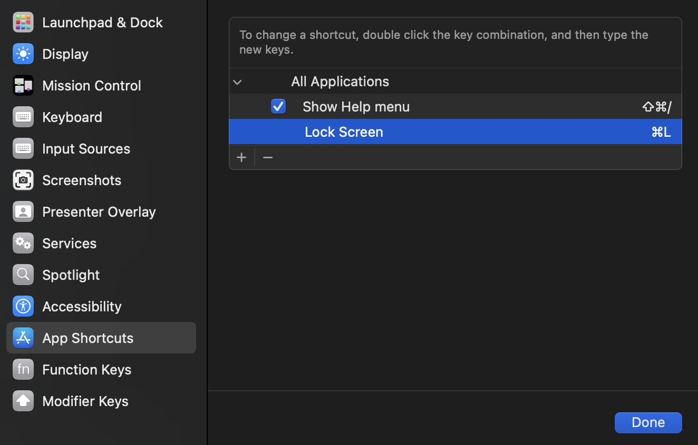

## Misc configuration

### Xcode
Copy everything under `resources/app-configuration/xcode` to `~/Library/Developer/Xcode/UserData` so that xcode keybindings and fonts set.

Keyboard shortcut are change for these actions:
- **"Open Quickly..."** from `shift+cmd+O` to `cmd+K` 
- **"Show Quick Actions..."** from `shift+cmd+A` to `shift+cmd+K` 

### Other

1. Set macOS keyboard shortcut `cmd+§` to lock the screen: 